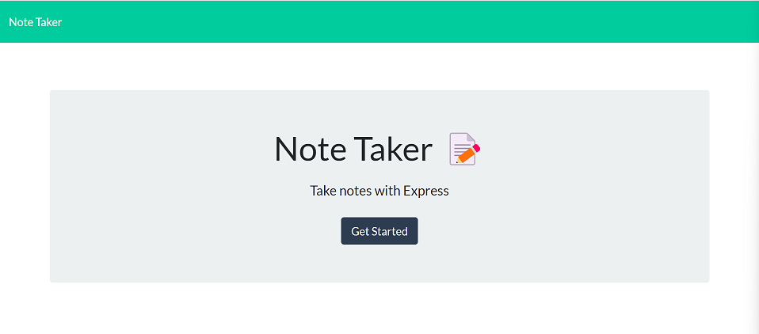

  # Note Taker
  

  ## Table of Contents

  1. [Description](#description)

  2. [Installation Instructions](#installation-instructions)

  3. [Usage Information](#usage-information)

  4. [Contributing](#contributing)

  5. [Tests](#tests)

  6. [Questions](#questions)

  ## Description

  Note Taker is a note-taking application that allows a user to create and save notes using an express.js server.

  ## Installation Instructions

  To install, clone the repository into your local machine.

  ## Usage Information

  To use Note Taker, run node server.js in the directory terminal, or visit the [deployed application](https://limitless-woodland-48312.herokuapp.com/) hosted on heroku.

  

  ## Contributing

  To contribute, please reach out to me via the contact forms below. 

  ## Tests

 No tests included.

  
  ## License 

  This application is licensed under the MIT license.

  https://opensource.org/licenses/MIT

  

  ## Questions

  If you have any questions, you can contact me via:
  | :memo:  [GitHub](https://github.com/OwenMG)   |
  |-----------------------------------------------------------|

  | :memo:  [Email](mailto:omgwebdev@gmail.com)                  |
  |-----------------------------------------------------------|
